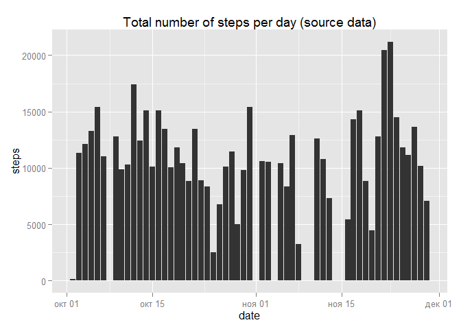
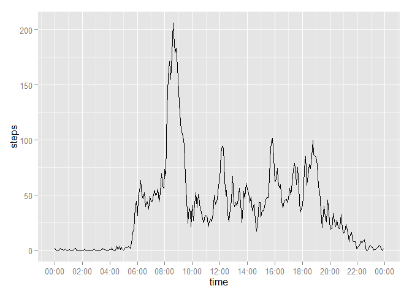
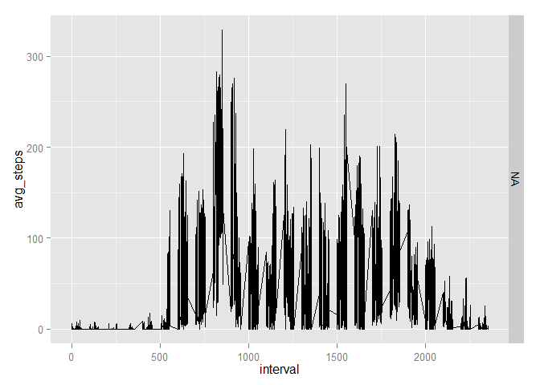
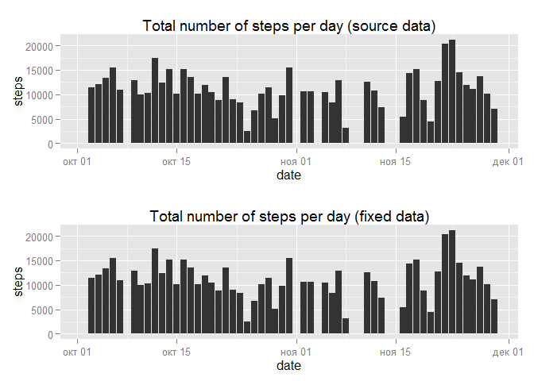
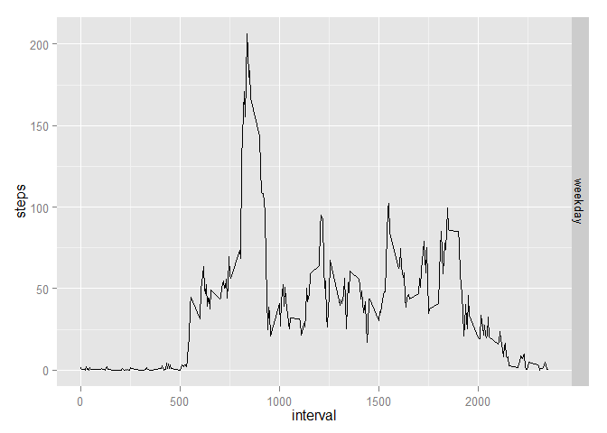

# Reproducible Research: Peer Assessment 1


```r
#Header code, setup required libraries
library(ggplot2)
library(plyr)
```

# Loading and preprocessing the data

```r
connection <- unz("activity.zip","activity.csv")
activity <- read.table(file = connection,header = TRUE,sep = ",")
activity$datetime <- as.POSIXct(with(activity,paste(date,paste(interval %/% 100, interval %% 100, sep=":"))),format="%Y-%m-%d %H:%M",tz="")
library(scales)
library(grid)
library(gridExtra)
```

```
## Warning: package 'gridExtra' was built under R version 3.1.2
```

# What is mean total number of steps taken per day?


```r
stepsPerDay <- setNames(
      aggregate(
          steps~as.Date(date),
          activity,
          sum,
          na.rm = TRUE),
      c("date","steps")
    )
hist1 <- ggplot(stepsPerDay,aes(x=date,y=steps)) + 
  geom_bar(stat="identity") + 
  ggtitle("Total number of steps per day (source data)")

print(hist1)
```

```
## Warning in grid.Call(L_textBounds, as.graphicsAnnot(x$label), x$x, x$y, :
## неизвестна ширина символа 0xee
```

```
## Warning in grid.Call(L_textBounds, as.graphicsAnnot(x$label), x$x, x$y, :
## неизвестна ширина символа 0xee
```

```
## Warning in grid.Call(L_textBounds, as.graphicsAnnot(x$label), x$x, x$y, :
## неизвестна ширина символа 0xed
```

```
## Warning in grid.Call(L_textBounds, as.graphicsAnnot(x$label), x$x, x$y, :
## неизвестна ширина символа 0xed
```

```
## Warning in grid.Call(L_textBounds, as.graphicsAnnot(x$label), x$x, x$y, :
## неизвестна ширина символа 0xe4
```

```
## Warning in grid.Call(L_textBounds, as.graphicsAnnot(x$label), x$x, x$y, :
## неизвестна ширина символа 0xee
```

```
## Warning in grid.Call(L_textBounds, as.graphicsAnnot(x$label), x$x, x$y, :
## неизвестна ширина символа 0xee
```

```
## Warning in grid.Call(L_textBounds, as.graphicsAnnot(x$label), x$x, x$y, :
## неизвестна ширина символа 0xed
```

```
## Warning in grid.Call(L_textBounds, as.graphicsAnnot(x$label), x$x, x$y, :
## неизвестна ширина символа 0xed
```

```
## Warning in grid.Call(L_textBounds, as.graphicsAnnot(x$label), x$x, x$y, :
## неизвестна ширина символа 0xe4
```

```
## Warning in grid.Call(L_textBounds, as.graphicsAnnot(x$label), x$x, x$y, :
## неизвестна ширина символа 0xee
```

```
## Warning in grid.Call(L_textBounds, as.graphicsAnnot(x$label), x$x, x$y, :
## неизвестна ширина символа 0xee
```

```
## Warning in grid.Call(L_textBounds, as.graphicsAnnot(x$label), x$x, x$y, :
## неизвестна ширина символа 0xed
```

```
## Warning in grid.Call(L_textBounds, as.graphicsAnnot(x$label), x$x, x$y, :
## неизвестна ширина символа 0xed
```

```
## Warning in grid.Call(L_textBounds, as.graphicsAnnot(x$label), x$x, x$y, :
## неизвестна ширина символа 0xe4
```

```
## Warning in grid.Call(L_textBounds, as.graphicsAnnot(x$label), x$x, x$y, :
## неизвестна ширина символа 0xee
```

```
## Warning in grid.Call(L_textBounds, as.graphicsAnnot(x$label), x$x, x$y, :
## неизвестна ширина символа 0xee
```

```
## Warning in grid.Call(L_textBounds, as.graphicsAnnot(x$label), x$x, x$y, :
## неизвестна ширина символа 0xed
```

```
## Warning in grid.Call(L_textBounds, as.graphicsAnnot(x$label), x$x, x$y, :
## неизвестна ширина символа 0xed
```

```
## Warning in grid.Call(L_textBounds, as.graphicsAnnot(x$label), x$x, x$y, :
## неизвестна ширина символа 0xe4
```

```
## Warning in grid.Call.graphics(L_text, as.graphicsAnnot(x$label), x$x, x$y,
## : неизвестна ширина символа 0xee
```

```
## Warning in grid.Call.graphics(L_text, as.graphicsAnnot(x$label), x$x, x$y,
## : неизвестна ширина символа 0xee
```

```
## Warning in grid.Call.graphics(L_text, as.graphicsAnnot(x$label), x$x, x$y,
## : неизвестна ширина символа 0xed
```

```
## Warning in grid.Call.graphics(L_text, as.graphicsAnnot(x$label), x$x, x$y,
## : неизвестна ширина символа 0xed
```

```
## Warning in grid.Call.graphics(L_text, as.graphicsAnnot(x$label), x$x, x$y,
## : неизвестна ширина символа 0xe4
```

 

```r
  summary(stepsPerDay$steps)
```

```
##    Min. 1st Qu.  Median    Mean 3rd Qu.    Max. 
##      41    8841   10760   10770   13290   21190
```

```r
  mm_1 <- c(mean = mean(stepsPerDay$steps),median = median(stepsPerDay$steps))
  print(mm_1)
```

```
##     mean   median 
## 10766.19 10765.00
```

# What is the average daily activity pattern?

```r
  avgPattern <- aggregate(steps~interval,activity,mean,na.rm = TRUE)
avgPattern$time <- as.POSIXct(with(avgPattern,paste(interval %/% 100, interval %% 100, sep=":")),format="%H:%M")
plot <- ggplot(avgPattern,aes(x=time,y=steps)) + 
          geom_line() + 
          scale_x_datetime(breaks = date_breaks("2 hour"),labels = date_format("%H:%M"))
print(plot)
```

 

```r
with(avgPattern,avgPattern[steps == max(steps),])
```

```
##     interval    steps                time
## 104      835 206.1698 2014-11-16 08:35:00
```

#The five minute interval with the highest mean step-count is interval 

# Imputing missing values

#There are 2304 incomplete records, unevenly distributed through the data.


```r
mis <- aggregate(cnt~date,cbind(activity[is.na(activity$steps),],cnt=c(1)),sum,na.rm = FALSE)
mis$dow <- weekdays(as.Date(mis$date),abbreviate=TRUE)
print(mis[,c(1,3,2)])
```

```
##         date dow cnt
## 1 2012-10-01  Пн 288
## 2 2012-10-08  Пн 288
## 3 2012-11-01  Чт 288
## 4 2012-11-04  Вс 288
## 5 2012-11-09  Пт 288
## 6 2012-11-10  Сб 288
## 7 2012-11-14  Ср 288
## 8 2012-11-30  Пт 288
```

```r
unique(mis$dow)
```

```
## [1] "Пн" "Чт" "Вс" "Пт" "Сб" "Ср"
```

```r
ref_ds <- aggregate(steps~interval+weekdays(datetime,abbreviate=TRUE),activity,FUN=mean,na.rm=TRUE)
colnames(ref_ds) <- c("interval","dow","avg_steps")
ref_ds$dow <- factor(ref_ds$dow,levels = c("Mon","Tue","Wed","Thu","Fri","Sat","Sun"))
ggplot(ref_ds,aes(x=interval,y=avg_steps)) + geom_line() + facet_grid("dow ~ .")
```

 

```r
activity$dow <- weekdays(activity$datetime,abbreviate=TRUE)
af <- merge(activity,ref_ds,by=c("dow","interval"),all.x = TRUE)
af <- af[with(af,order(date,interval)),]
af$fixed_steps <- ifelse(is.na(af$steps),af$avg_steps,af$steps)
```
 
#Interpolation is done by using the average of the previous valid observation and the next valid observation, or the average for the relevant 5-min interval if there is no valid previous/next observation. This produces smooth activity-over-the-day lines for each individual day, but is not very fast.
 

```r
#q3
step_interpolation <- function(rownumber){
  prevrow=rownumber;
  nextrow=rownumber;
  while(is.na(activity$steps[prevrow])){
    prevrow=prevrow-1
    if(prevrow<1)return(mean(activity[activity$interval==activity$interval[rownumber],"steps"],na.rm=TRUE))
  }
  while(is.na(activity$steps[nextrow])){
    nextrow=nextrow+1
    if(nextrow>nrow(activity))return(mean(activity[activity$interval==activity$interval[rownumber],"steps"],na.rm=TRUE))
  }
  return(
    (activity$steps[prevrow]+activity$steps[nextrow])/2
  )
}

activity_guessNA <-activity
for(n in 1:nrow(activity)){
  if(is.na(activity$steps[n])){
    activity_guessNA$steps[n]=step_interpolation(n);
  }
}
```
# calculating data set for histogram

```r
  stepsPerDay2 <- setNames(
      aggregate(
          fixed_steps~as.Date(date),
          af,
          sum,
          na.rm = TRUE),
      c("date","steps")
    )
```
# plotting histogram

```r
hist2 <- ggplot(stepsPerDay2,aes(x=date,y=steps)) + 
  geom_bar(stat="identity") + 
  ggtitle("Total number of steps per day (fixed data)")
```
# combining with previous

```r
grid.arrange(hist1, hist2, nrow=2)
```

```
## Warning in grid.Call(L_textBounds, as.graphicsAnnot(x$label), x$x, x$y, :
## неизвестна ширина символа 0xee
```

```
## Warning in grid.Call(L_textBounds, as.graphicsAnnot(x$label), x$x, x$y, :
## неизвестна ширина символа 0xee
```

```
## Warning in grid.Call(L_textBounds, as.graphicsAnnot(x$label), x$x, x$y, :
## неизвестна ширина символа 0xed
```

```
## Warning in grid.Call(L_textBounds, as.graphicsAnnot(x$label), x$x, x$y, :
## неизвестна ширина символа 0xed
```

```
## Warning in grid.Call(L_textBounds, as.graphicsAnnot(x$label), x$x, x$y, :
## неизвестна ширина символа 0xe4
```

```
## Warning in grid.Call(L_textBounds, as.graphicsAnnot(x$label), x$x, x$y, :
## неизвестна ширина символа 0xee
```

```
## Warning in grid.Call(L_textBounds, as.graphicsAnnot(x$label), x$x, x$y, :
## неизвестна ширина символа 0xee
```

```
## Warning in grid.Call(L_textBounds, as.graphicsAnnot(x$label), x$x, x$y, :
## неизвестна ширина символа 0xed
```

```
## Warning in grid.Call(L_textBounds, as.graphicsAnnot(x$label), x$x, x$y, :
## неизвестна ширина символа 0xed
```

```
## Warning in grid.Call(L_textBounds, as.graphicsAnnot(x$label), x$x, x$y, :
## неизвестна ширина символа 0xe4
```

```
## Warning in grid.Call(L_textBounds, as.graphicsAnnot(x$label), x$x, x$y, :
## неизвестна ширина символа 0xee
```

```
## Warning in grid.Call(L_textBounds, as.graphicsAnnot(x$label), x$x, x$y, :
## неизвестна ширина символа 0xee
```

```
## Warning in grid.Call(L_textBounds, as.graphicsAnnot(x$label), x$x, x$y, :
## неизвестна ширина символа 0xed
```

```
## Warning in grid.Call(L_textBounds, as.graphicsAnnot(x$label), x$x, x$y, :
## неизвестна ширина символа 0xed
```

```
## Warning in grid.Call(L_textBounds, as.graphicsAnnot(x$label), x$x, x$y, :
## неизвестна ширина символа 0xe4
```

```
## Warning in grid.Call(L_textBounds, as.graphicsAnnot(x$label), x$x, x$y, :
## неизвестна ширина символа 0xee
```

```
## Warning in grid.Call(L_textBounds, as.graphicsAnnot(x$label), x$x, x$y, :
## неизвестна ширина символа 0xee
```

```
## Warning in grid.Call(L_textBounds, as.graphicsAnnot(x$label), x$x, x$y, :
## неизвестна ширина символа 0xed
```

```
## Warning in grid.Call(L_textBounds, as.graphicsAnnot(x$label), x$x, x$y, :
## неизвестна ширина символа 0xed
```

```
## Warning in grid.Call(L_textBounds, as.graphicsAnnot(x$label), x$x, x$y, :
## неизвестна ширина символа 0xe4
```

```
## Warning in grid.Call.graphics(L_text, as.graphicsAnnot(x$label), x$x, x$y,
## : неизвестна ширина символа 0xee
```

```
## Warning in grid.Call.graphics(L_text, as.graphicsAnnot(x$label), x$x, x$y,
## : неизвестна ширина символа 0xee
```

```
## Warning in grid.Call.graphics(L_text, as.graphicsAnnot(x$label), x$x, x$y,
## : неизвестна ширина символа 0xed
```

```
## Warning in grid.Call.graphics(L_text, as.graphicsAnnot(x$label), x$x, x$y,
## : неизвестна ширина символа 0xed
```

```
## Warning in grid.Call.graphics(L_text, as.graphicsAnnot(x$label), x$x, x$y,
## : неизвестна ширина символа 0xe4
```

```
## Warning in grid.Call(L_textBounds, as.graphicsAnnot(x$label), x$x, x$y, :
## неизвестна ширина символа 0xee
```

```
## Warning in grid.Call(L_textBounds, as.graphicsAnnot(x$label), x$x, x$y, :
## неизвестна ширина символа 0xee
```

```
## Warning in grid.Call(L_textBounds, as.graphicsAnnot(x$label), x$x, x$y, :
## неизвестна ширина символа 0xed
```

```
## Warning in grid.Call(L_textBounds, as.graphicsAnnot(x$label), x$x, x$y, :
## неизвестна ширина символа 0xed
```

```
## Warning in grid.Call(L_textBounds, as.graphicsAnnot(x$label), x$x, x$y, :
## неизвестна ширина символа 0xe4
```

```
## Warning in grid.Call(L_textBounds, as.graphicsAnnot(x$label), x$x, x$y, :
## неизвестна ширина символа 0xee
```

```
## Warning in grid.Call(L_textBounds, as.graphicsAnnot(x$label), x$x, x$y, :
## неизвестна ширина символа 0xee
```

```
## Warning in grid.Call(L_textBounds, as.graphicsAnnot(x$label), x$x, x$y, :
## неизвестна ширина символа 0xed
```

```
## Warning in grid.Call(L_textBounds, as.graphicsAnnot(x$label), x$x, x$y, :
## неизвестна ширина символа 0xed
```

```
## Warning in grid.Call(L_textBounds, as.graphicsAnnot(x$label), x$x, x$y, :
## неизвестна ширина символа 0xe4
```

```
## Warning in grid.Call(L_textBounds, as.graphicsAnnot(x$label), x$x, x$y, :
## неизвестна ширина символа 0xee
```

```
## Warning in grid.Call(L_textBounds, as.graphicsAnnot(x$label), x$x, x$y, :
## неизвестна ширина символа 0xee
```

```
## Warning in grid.Call(L_textBounds, as.graphicsAnnot(x$label), x$x, x$y, :
## неизвестна ширина символа 0xed
```

```
## Warning in grid.Call(L_textBounds, as.graphicsAnnot(x$label), x$x, x$y, :
## неизвестна ширина символа 0xed
```

```
## Warning in grid.Call(L_textBounds, as.graphicsAnnot(x$label), x$x, x$y, :
## неизвестна ширина символа 0xe4
```

```
## Warning in grid.Call(L_textBounds, as.graphicsAnnot(x$label), x$x, x$y, :
## неизвестна ширина символа 0xee
```

```
## Warning in grid.Call(L_textBounds, as.graphicsAnnot(x$label), x$x, x$y, :
## неизвестна ширина символа 0xee
```

```
## Warning in grid.Call(L_textBounds, as.graphicsAnnot(x$label), x$x, x$y, :
## неизвестна ширина символа 0xed
```

```
## Warning in grid.Call(L_textBounds, as.graphicsAnnot(x$label), x$x, x$y, :
## неизвестна ширина символа 0xed
```

```
## Warning in grid.Call(L_textBounds, as.graphicsAnnot(x$label), x$x, x$y, :
## неизвестна ширина символа 0xe4
```

```
## Warning in grid.Call.graphics(L_text, as.graphicsAnnot(x$label), x$x, x$y,
## : неизвестна ширина символа 0xee
```

```
## Warning in grid.Call.graphics(L_text, as.graphicsAnnot(x$label), x$x, x$y,
## : неизвестна ширина символа 0xee
```

```
## Warning in grid.Call.graphics(L_text, as.graphicsAnnot(x$label), x$x, x$y,
## : неизвестна ширина символа 0xed
```

```
## Warning in grid.Call.graphics(L_text, as.graphicsAnnot(x$label), x$x, x$y,
## : неизвестна ширина символа 0xed
```

```
## Warning in grid.Call.graphics(L_text, as.graphicsAnnot(x$label), x$x, x$y,
## : неизвестна ширина символа 0xe4
```

 

```r
 mm_2 <- c(mean = mean(stepsPerDay2$steps),median = median(stepsPerDay2$steps))
  comparison <- rbind(source = mm_1, fixed = mm_2, delta = mm_2-mm_1)
  print(comparison)
```

```
##            mean median
## source 10766.19  10765
## fixed  10766.19  10765
## delta      0.00      0
```

# Are there differences in activity patterns between weekdays and weekends?

#Looks like activity is higher on the weekends, particularly in the middle of the day, although it is lower early in the morning just after waking.


```r
week_diff <- aggregate(
  steps~dow+interval,  # group steps by weekend/weekday and interval to find average steps 
  with(
    activity,
    data.frame(
      dow = factor(
        ifelse(
          weekdays(as.Date(date)) %in% c("Sunday","Saturday"),
          "weekend",  # if sunday or saturday
          "weekday"   # else
        )
      ),
      interval,
      steps
    )
  ),
  FUN = mean,
  rm.na = TRUE
)
ggplot(week_diff,aes(x=interval,y=steps)) + geom_line() + facet_grid("dow ~ .")
```

 
